# MazeBots: Multi-robot maze navigation

MazeBots is an environment for multi-agent reinforcement learning research.
It provides an interface for human and AI control, tracking, and evaluation,
as well as training with a custom implementation of the
[phasic policy gradient (PPG)](https://proceedings.mlr.press/v139/cobbe21a.html)
algorithm.

Page index:
- [Environment](#environment)
- [Installation](#installation)
- [Running](#running)
- [Citation](#citation)


---


## Environment

<p align="center">
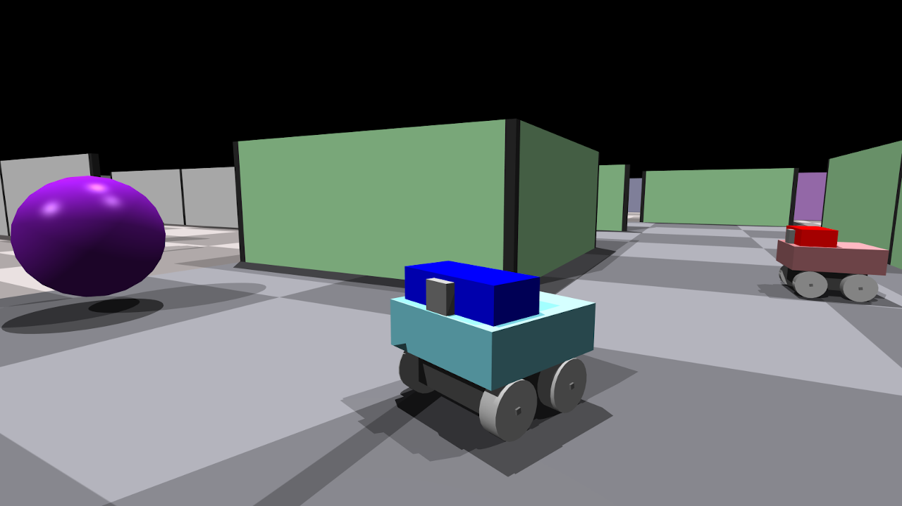
</p>

The environment is populated by 4-wheeled agents with various sensors
and a colour-grounded communication channel: agents can change their body colour
and also emit it as "sound".

Each agent is tasked with navigating a maze and delivering cargo to (finding)
a specific landmark (spherical object) based on its unique and distinct colour.
After an agent accomplishes its task, it is given a new one,
up until the end of a few-minutes-long episode.

However in the multi-agent case, agents can rely on information
from past searches of other agents to speed up their own current search.
The potential and goal is therefore to learn to communicate and cooperate
to achieve a higher collective throughput.


---


### Sensing

Agents primarily rely on visual data from their colour and depth cameras.
They also process vector observations, like IMU and motor feedback.

<p align="center">
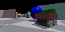

</p>


---


### Levels

Environment instances are randomly generated with parameters corresponding to
one of seven levels. Higher levels correspond to larger mazes, more landmarks,
more coexisting agents, and longer episodes.

This increasing difficulty can facilitate a learning curriculum
by transferring policies after they master a level.

<p align="center">
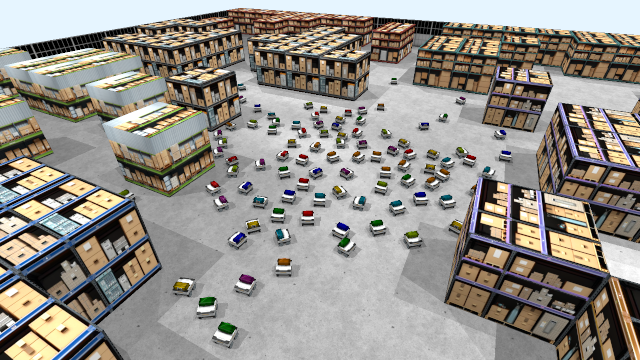
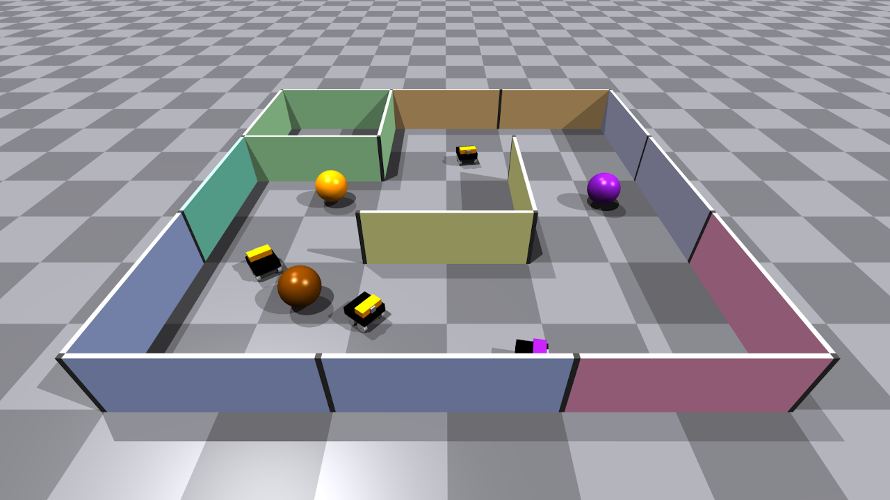
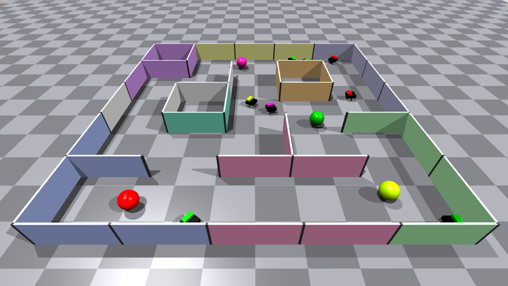
</p>

<p align="center">
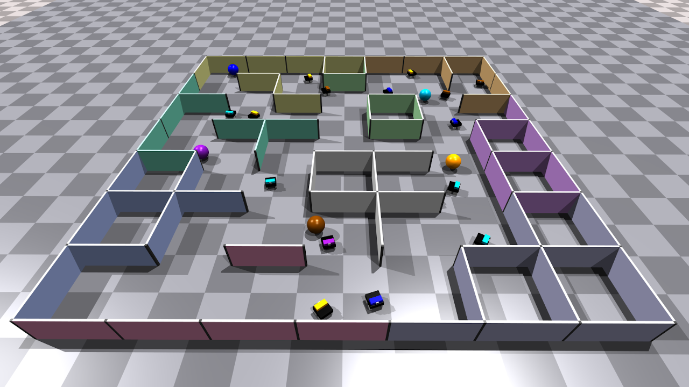
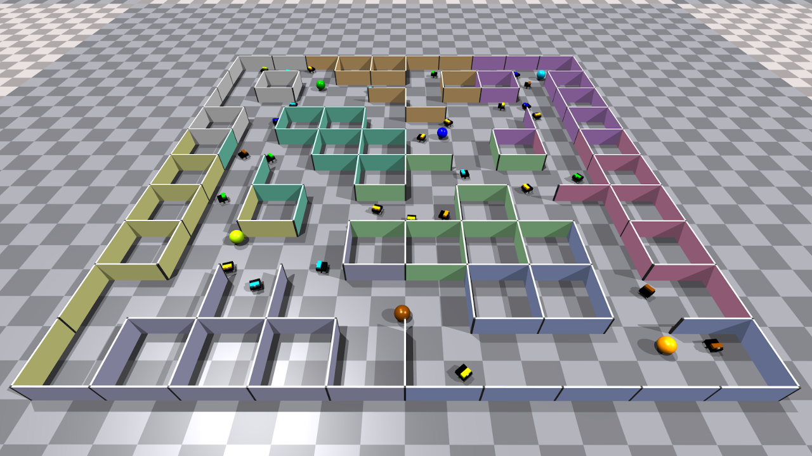
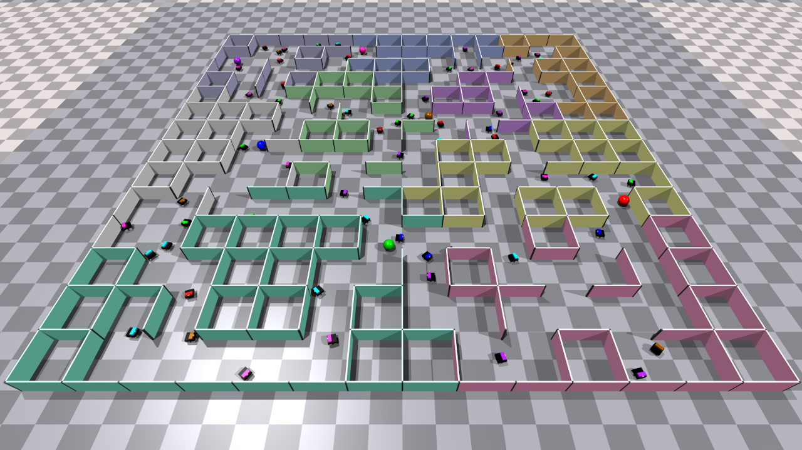
</p>

<p align="center">
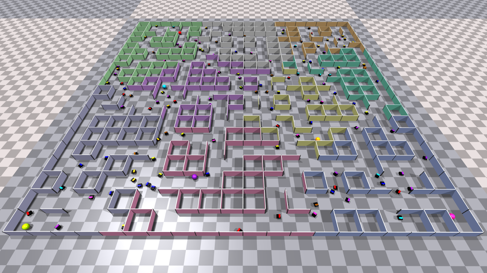
</p>


---


### Parallel simulation

Besides the environment being multi-agent, several instances can be simulated
together in lockstep.

Physics and rendering is handled by NVIDIA's Isaac Gym (preview 4).
In regard to scaling, physics in Isaac Gym is highly efficient,
while rendering is the most critical bottleneck.

<p align="center">
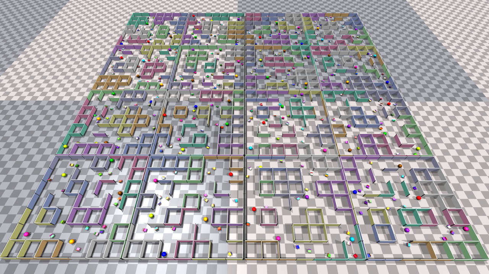
</p>


---


### Resetting

Isaac Gym requires all entities to be created at the start of the process.
Hence, instances are formed and reset by hiding some walls below the ground plane,
while shifting agents and landmarks around and recolouring them.

This is also the main limitation preventing training on different levels at once,
as they correspond to different numbers of entities.

<p align="center">
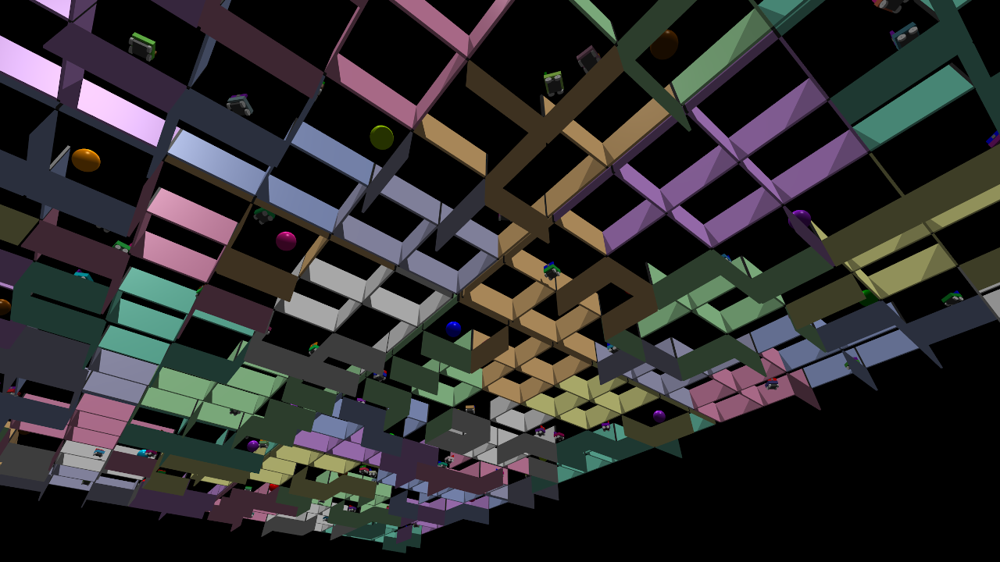
</p>


---


## Installation

Start by downloading or cloning this repository.

Setup will check for the following packages:
- `pillow`: saving images,
- `numpy`: vectorised processing,
- `scipy`: rotation, triangulation, and clustering,
- `numba`: accelerating standard Python,
- `torch >= 2.0`: main processing and AI integration with CUDA graphs,
- `tensorboard`: tracking training progress,
- `isaacgym`: physics and rendering.

If you already have Python 3.8 on your system, most of these packages should have
their dependencies handled normally during setup, but it is strongly advised
that PyTorch and Isaac Gym are installed separately beforehand.

See the [PyTorch instructions](https://pytorch.org/get-started/locally/)
and ensure that the installation targets your CUDA device.

[Isaac Gym](https://developer.nvidia.com/isaac-gym), on the other hand,
is not open-source and requires you to sign up for an NVIDIA account
as a developer to then be able to download the code and binaries.
Also note that NVIDIA's efforts have shifted towards
[Isaac Sim](https://developer.nvidia.com/isaac-sim),
though there is still some activity on the official
[forums](https://forums.developer.nvidia.com/c/agx-autonomous-machines/isaac/isaac-gym/322).

Finally, install MazeBots in editable/development mode from the main directory with:
```
pip install -e .
```


---


## Running

All of the different modes can be run through the runner with:
```
python runner.py --mode mode --args "args for mode" --exe ""
```

By default, the usual argument configuration will be used for each mode.
See the code for [`runner.py`](runner.py) and `src` files for all argument options.

The `--exe` option is there to run a command of this form before the actual session:
```
export LD_LIBRARY_PATH=/home/username/anaconda3/envs/envname/lib
```

This option was used to address an error associated with `libpython` on Ubuntu 20.04.
If you have a different system, you may delete it from the runner.
Otherwise, you need to edit it for your specific case.


---


## Citation

If you use or reference MazeBots in your work, please cite the following paper (WIP):
```
@article{MazeBots2023,
 title={WIP},
 author={Puc, Jernej and ...},
 year={2023}}
```
